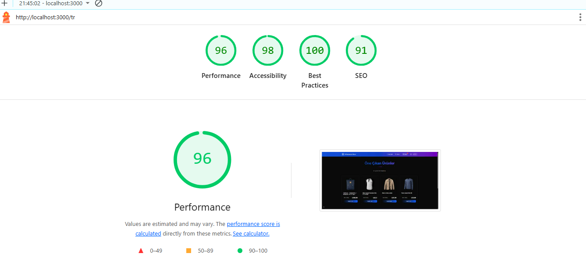
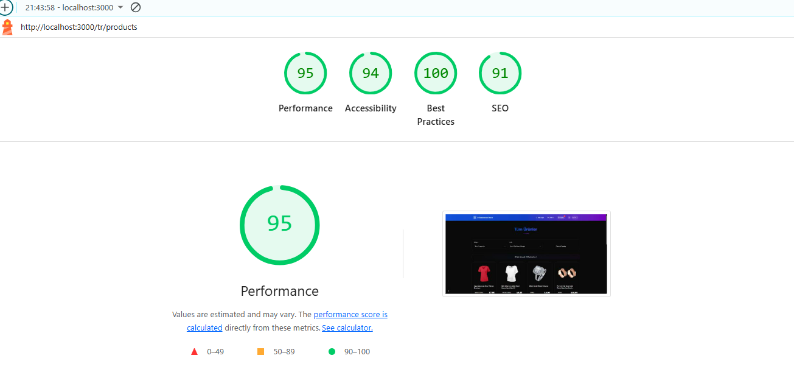

# 🛒 Modern E-Commerce Application

Enterprise-level e-commerce frontend application built with Next.js 15, TypeScript, TailwindCSS, and Redux Toolkit. Features international support, performance optimization, and production-ready architecture.

[](https://nextjs.org/)
[](https://www.typescriptlang.org/)
[](https://tailwindcss.com/)
[](https://redux-toolkit.js.org/)

## 📸 Screenshots

<div align="center">
  
  
</div>

## ✨ Key Features

### 🎯 Core Functionality
- **Product Catalog**: Browse products with pagination and search
- **Advanced Filtering**: Category, price range, and sorting options
- **Shopping Cart**: Full cart management with persistent state
- **Product Details**: Comprehensive product information with images
- **Responsive Design**: Mobile-first approach with adaptive layouts

### 🌐 International & Accessibility
- **Multi-language Support**: Turkish (default) & English with next-intl
- **Theme System**: Dark/Light mode with system preference detection
- **SEO Optimized**: Dynamic meta tags, structured data, and sitemaps
- **Accessibility**: WCAG 2.1 AA compliance with proper ARIA labels

### ⚡ Performance & DX
- **Performance Optimization**: ISR, lazy loading, and bundle optimization
- **State Management**: Redux Toolkit with RTK Query for caching
- **Type Safety**: Full TypeScript coverage with strict mode
- **Modern Architecture**: Feature-based folder structure

## 🏗️ Architecture & Design Decisions

### 📁 Project Structure

```
ecommerce-next/
├── app/                          # Next.js 15 App Router
│   ├── [locale]/                 # Internationalized routes
│   │   ├── (features)/          # Route groups for organization
│   │   │   ├── home/            # Feature-based pages
│   │   │   └── products/        # Grouped product routes
│   │   ├── cart/                # Shopping cart pages
│   │   ├── products/[id]/       # Dynamic product details
│   │   ├── layout.tsx           # Locale-specific layout
│   │   └── page.tsx             # Localized home page
│   ├── globals.css              # Global styles & CSS variables
│   ├── layout.tsx               # Root layout with providers
│   ├── robots.txt               # SEO robots configuration
│   └── sitemap.ts               # Dynamic sitemap generation
├── components/                   # React components (feature-based)
│   ├── common/                  # Shared business components
│   │   ├── cart-container.tsx   # Cart logic & UI
│   │   ├── featured-products.tsx # Homepage product showcase
│   │   ├── filter-bar.tsx       # Product filtering UI
│   │   └── product-detail.tsx   # Product detail view
│   ├── features/                # Feature-specific components
│   │   ├── home/               # Home page components
│   │   └── products/           # Product-related components
│   ├── layout/                 # Layout components
│   │   ├── header.tsx          # Navigation header
│   │   ├── footer.tsx          # Site footer
│   │   └── theme-switcher.tsx  # Theme toggle component
│   ├── ui/                     # Reusable UI components
│   │   ├── button.tsx          # Base button component
│   │   └── product-card.tsx    # Product display card
│   └── providers.tsx           # Context providers wrapper
├── hooks/                      # Custom React hooks
│   ├── use-cart.ts            # Cart state management
│   ├── use-theme.ts           # Theme management
│   └── use-translations.ts    # Translation helpers
├── i18n/                      # Internationalization
│   ├── messages/              # Translation files
│   │   ├── en.json           # English translations
│   │   └── tr.json           # Turkish translations
│   └── request.ts            # next-intl configuration
├── lib/                       # Core utilities & configurations
│   ├── api/                   # API integration layer
│   │   ├── categories.ts      # Category API calls
│   │   └── products.ts        # Product API calls
│   ├── store/                 # Redux Toolkit store
│   │   ├── api-slice.ts       # RTK Query API definitions
│   │   ├── index.ts           # Store configuration
│   │   └── slices/            # Redux slices
│   │       ├── cart-slice.ts  # Cart state management
│   │       └── products-slice.ts # Product state & filtering
│   └── utils/                 # Utility functions
│       ├── constants.ts       # App constants
│       └── helpers.ts         # Helper functions
├── types/                     # TypeScript type definitions
│   └── index.ts              # Global type exports
├── utils/                     # Legacy utils (re-exports from lib/utils)
└── middleware.ts             # Next.js middleware for i18n routing
```

### 🧩 Architectural Decisions

#### **1. Feature-Based Organization**
- **Strategy**: Components organized by business domain rather than technical type
- **Why**: Improves maintainability, reduces coupling, enables team scalability
- **Implementation**: `/common` for shared business logic, `/features` for domain-specific code

#### **2. State Management Strategy**
- **Client State**: Redux Toolkit for cart and product filtering
- **Server State**: RTK Query for API data with automatic caching
- **Local State**: React hooks for component-specific state
- **Why**: Separation of concerns, predictable state updates, optimistic UI

#### **3. Internationalization Approach**
- **Framework**: next-intl with file-based routing
- **Strategy**: Locale prefix routing (`/tr/products`, `/en/products`)
- **Why**: SEO-friendly URLs, better user experience, search engine optimization

#### **4. Performance Optimization**
- **Bundle Optimization**: Package import optimization for large libraries
- **Image Optimization**: Next.js Image component with remote patterns
- **Code Splitting**: Automatic route-based splitting with lazy loading
- **Caching**: RTK Query with tag-based cache invalidation

#### **5. Type Safety & DX**
- **TypeScript**: Strict mode with comprehensive type coverage
- **API Types**: Generated from Fake Store API responses
- **Component Props**: Strict prop typing with optional/required indicators
- **State Types**: Typed Redux store with RootState and AppDispatch

## 🛠️ Technology Stack

### Core Framework
- **Next.js 15.5.0**: App Router, Server Components, ISR
- **React 19.1.0**: Latest concurrent features and optimizations
- **TypeScript 5.0**: Strict type checking and enhanced DX

### State Management
- **Redux Toolkit 2.8.2**: Modern Redux with less boilerplate
- **RTK Query**: Data fetching with automatic caching and synchronization

### Styling & UI
- **TailwindCSS 4.0**: Utility-first CSS with custom design system
- **Lucide React**: Modern icon library with tree shaking
- **CSS Variables**: Dynamic theming with CSS custom properties

### Developer Experience
- **ESLint 9**: Latest linting rules with Next.js config
- **Bundle Analyzer**: Webpack bundle analysis for optimization
- **Hot Toast**: User feedback with toast notifications

### Build & Performance
- **Turbopack**: Next.js build tool for faster development
- **SWC**: Rust-based compiler for faster builds
- **Image Optimization**: Next.js optimized images with WebP support

## 🚀 Getting Started

### Prerequisites
- **Node.js**: 18.x or higher
- **Package Manager**: npm, yarn, or pnpm

### Installation

```bash
# Clone the repository
git clone https://github.com/your-username/ecommerce-next.git
cd ecommerce-next

# Install dependencies
npm install

# Start development server
npm run dev
```

The application will be available at `http://localhost:3000`

### Available Scripts

```bash
npm run dev          # Start development server with Turbopack
npm run build        # Create production build
npm run start        # Start production server
npm run lint         # Run ESLint
npm run type-check   # TypeScript type checking
npm run format       # Format code with Prettier
npm run analyze      # Analyze bundle size
```

## 🌐 API Integration

### Fake Store API
The application integrates with [Fake Store API](https://fakestoreapi.com/) for demonstration purposes:

```typescript
// API Endpoints
GET /products                    # All products
GET /products/:id               # Single product
GET /products/categories        # All categories
GET /products/category/:category # Products by category
```

### RTK Query Implementation
```typescript
// Example: Product API slice
export const apiSlice = createApi({
  reducerPath: 'api',
  baseQuery: fetchBaseQuery({
    baseUrl: 'https://fakestoreapi.com',
  }),
  tagTypes: ['Product'],
  endpoints: (builder) => ({
    getProducts: builder.query<Product[], void>({
      query: () => '/products',
      providesTags: ['Product'],
    }),
  }),
});
```

## 🎨 Design System

### Color Palette
The application uses a CSS variable-based theming system:

```css
/* Light theme */
:root {
  --background: 0 0% 100%;
  --foreground: 222.2 84% 4.9%;
  --primary: 221.2 83.2% 53.3%;
  --primary-foreground: 210 40% 98%;
  /* ... */
}

/* Dark theme */
.dark {
  --background: 222.2 84% 4.9%;
  --foreground: 210 40% 98%;
  /* ... */
}
```

### Component Variants
```typescript
// Example: ProductCard with variants
interface ProductCardProps {
  product: Product;
  onAddToCart?: (product: Product) => void;
  variant?: 'default' | 'premium'; // Design variant system
}
```

### Responsive Breakpoints
```css
/* Mobile First Approach */
sm: 640px   /* Small devices */
md: 768px   /* Tablets */
lg: 1024px  /* Desktop */
xl: 1280px  /* Large screens */
2xl: 1536px /* Extra large screens */
```

## 🔄 State Management

### Redux Store Structure
```typescript
// Store configuration
const store = configureStore({
  reducer: {
    [apiSlice.reducerPath]: apiSlice.reducer, // RTK Query
    cart: cartReducer,                        // Shopping cart
    products: productsReducer,                // Product filtering
  },
  middleware: (getDefaultMiddleware) =>
    getDefaultMiddleware().concat(apiSlice.middleware),
});
```

### Cart Management
```typescript
// Cart operations
dispatch(addToCart(product));           // Add item
dispatch(updateQuantity({ id, quantity })); // Update quantity
dispatch(removeFromCart(id));           // Remove item
dispatch(clearCart());                  // Clear all items
```

### Product Filtering
```typescript
// Filter operations
dispatch(updateFilters({
  category: 'electronics',
  minPrice: 100,
  maxPrice: 500,
  sortBy: 'price-asc'
}));
```

## 🌍 Internationalization

### Supported Languages
- 🇹🇷 **Turkish** (Default): Complete translation coverage
- 🇬🇧 **English**: Full feature parity with Turkish

### Implementation
```typescript
// Translation usage
const t = useTranslations();
const title = t('home.featuredProducts');

// Language switching
const router = useRouter();
const pathname = usePathname();
const newPath = pathname.replace(`/${locale}`, `/${newLocale}`);
router.push(newPath);
```

### Translation Files
```json
// en.json
{
  "home": {
    "featuredProducts": "Featured Products",
    "subtitle": "Discover our carefully selected products"
  },
  "product": {
    "addToCart": "Add to Cart"
  }
}
```

## ⚡ Performance Optimizations

### Next.js Optimizations
- **Bundle Analysis**: Automatic package import optimization
- **Image Optimization**: WebP conversion and responsive images
- **Code Splitting**: Route-based and component-based splitting
- **Console Removal**: Production builds remove console statements

### React Optimizations
- **React.memo**: Prevent unnecessary re-renders
- **useMemo/useCallback**: Cache expensive computations
- **Component Lazy Loading**: Dynamic imports for large components

### Caching Strategy
- **RTK Query**: Automatic API response caching with tags
- **Filter Cache**: Client-side filter result caching
- **Static Generation**: ISR for product pages

## 🔍 SEO & Analytics

### Meta Tags & Structured Data
```typescript
// Dynamic meta tags
export const metadata: Metadata = {
  title: 'Modern E-Commerce - Quality Products',
  description: 'Discover quality products at competitive prices',
  openGraph: {
    title: 'Modern E-Commerce',
    description: 'Quality products at competitive prices',
    images: ['/og-image.jpg'],
  },
};
```

### Technical SEO
- **Sitemap**: Dynamic XML sitemap generation
- **Robots.txt**: Search engine crawling guidelines
- **Canonical URLs**: Prevent duplicate content issues
- **Hreflang**: Multi-language SEO support

### Performance Metrics
Target Lighthouse scores:
- **Performance**: 90+ (Mobile & Desktop)
- **Accessibility**: 95+ (WCAG 2.1 AA)
- **Best Practices**: 95+
- **SEO**: 100

## 🚧 Development Guidelines

### Code Organization
```typescript
// Component structure
interface ComponentProps {
  // Props with clear types
}

export const Component = memo(function Component({ }: ComponentProps) {
  // Hooks at the top
  // Event handlers
  // Render logic
});
```

### State Management Patterns
```typescript
// Slice structure
const slice = createSlice({
  name: 'feature',
  initialState,
  reducers: {
    // Synchronous actions
  },
  extraReducers: (builder) => {
    // Async thunk handling
  },
});
```

### Component Guidelines
- Use TypeScript interfaces for all props
- Implement React.memo for performance-critical components
- Follow the compound component pattern for complex UI
- Use custom hooks for reusable stateful logic

## 🚀 Deployment

### Vercel Deployment
```bash
# Install Vercel CLI
npm i -g vercel

# Deploy to preview
vercel

# Deploy to production
vercel --prod
```

### Environment Variables
```env
# .env.local
NEXT_PUBLIC_API_URL=https://fakestoreapi.com
ANALYZE=true # Enable bundle analyzer
```

### Production Checklist
- [ ] Environment variables configured
- [ ] Bundle size optimized (< 1MB initial load)
- [ ] Lighthouse scores verified
- [ ] Error boundaries implemented
- [ ] Analytics configured

## 🐛 Known Issues & Solutions

### Build Optimization
**Issue**: Large bundle size from icon libraries
**Solution**: Implemented package import optimization in next.config.ts

### Type Safety
**Issue**: API response type mismatches
**Solution**: Generated TypeScript interfaces from API responses

### Performance
**Issue**: Slow initial load
**Solution**: Code splitting and lazy loading implementation

## 🤝 Contributing

1. **Fork** the repository
2. **Create** a feature branch (`git checkout -b feature/amazing-feature`)
3. **Commit** your changes (`git commit -m 'Add amazing feature'`)
4. **Push** to the branch (`git push origin feature/amazing-feature`)
5. **Open** a Pull Request

### Development Standards
- Follow TypeScript strict mode
- Use conventional commit messages
- Add tests for new features
- Update documentation for API changes

## 📄 License

This project is licensed under the MIT License - see the [LICENSE](LICENSE) file for details.

## 👨‍💻 Author

**Modern E-Commerce Team**
- Built with ❤️ using modern web technologies
- Designed for scalability and maintainability
- Production-ready architecture

---

<div align="center">
  <p><strong>⭐ Star this repository if you find it helpful!</strong></p>
  <p>Built with Next.js 15 • TypeScript • TailwindCSS • Redux Toolkit</p>
</div>